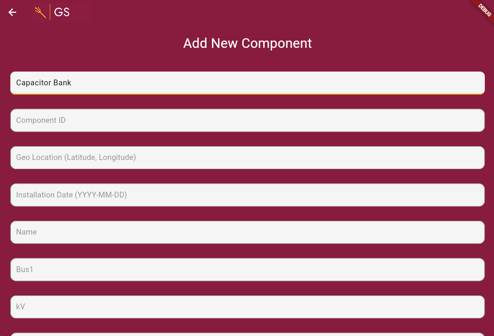

# Grid Scout

**Stack:** Python, Flask, MySQL, Dart via Flutter  
**Role:** Full Stack Developer with emphasis on the back-end 
**Dates:** 2024–2025  
**Repos:** [Back-end](https://github.com/EmperorPalkkitine/asugs_flask_backend.git), [Front-end](https://github.com/EmperorPalkkitine/asuGS-ios.git)

## Summary
GridScout is a smart data collection and model creation tool for electric power distribution systems that allows for rapid in-field distribution network modeling during equipment installation and maintenance via a mobile device application operated by technicians and other utility personnel. GridScout addresses the substantial need for utilities to efficiently manage the rapid growth of distributed energy resources (DERs) and aging grid infrastructure. As utilities shift towards smarter, more adaptive networks, existing processes for data collection and model updates are no longer sufficient. Overall functionality of the application is achieved through means of cellular assisted geolocation, development of an equipment/component database and integration to the distribution simulator software, OpenDSS.

## Screenshots / Media

Screenshot of one of the input pages for the mobile application.

## Key Features
- End-users are able to scan a QR code that will automatically fill out text input fields for ease of use
- Back-end coding does the heavy lifting by deciding whether the equipment installation is a replacement or new install based on data in the mySQL database
- AWS S3 file is automatically updated when technician finishes the job on the mobile application, providing simulation engineers by the minute up to date info on the equipment in the grid

## Technical Notes
- Flask RESTful API coded in Python communicates with the Dart front-end, the mySQL database, and the AWS S3 bucket
- With the exception of the AWS S3 bucket, all other development was done completely free of cost and open source

## What I learned

- **Build it the way people actually work.** Making “replace” vs “add new” match real work orders made the app easier to use.
- **QR codes are fast, but still need double-checks.** Using the first letter to guess the part type is handy, but the server must verify it.
- **Changes should be all-or-nothing.** When I update the database and the grid file, they should both succeed—or neither—so things don’t get out of sync.
- **Save versions before editing.** Keeping backups of the grid model (like save points) makes it easy to undo mistakes.
- **Show only the fields that matter.** The form changes based on the part type, so techs don’t see a bunch of useless boxes.
- **Validate in the app and on the server.** Catch bad numbers or missing info early to avoid bad data going in.
- **Keep a change history.** Logging “who changed what” turns debugging into a quick look-up instead of a guessing game.
- **Use plain names.** Buttons and endpoints that say “Replace component” or “Add component” are clearer than clever labels.
- **Plan for weak signal.** Small local caching and quick feedback make the app usable when the connection is spotty.
- **Run small checks before shipping.** A quick lint/test run catches breakages early.
- **Write short how-tos.** A one-page guide like “How to add a new part type” saves time later.